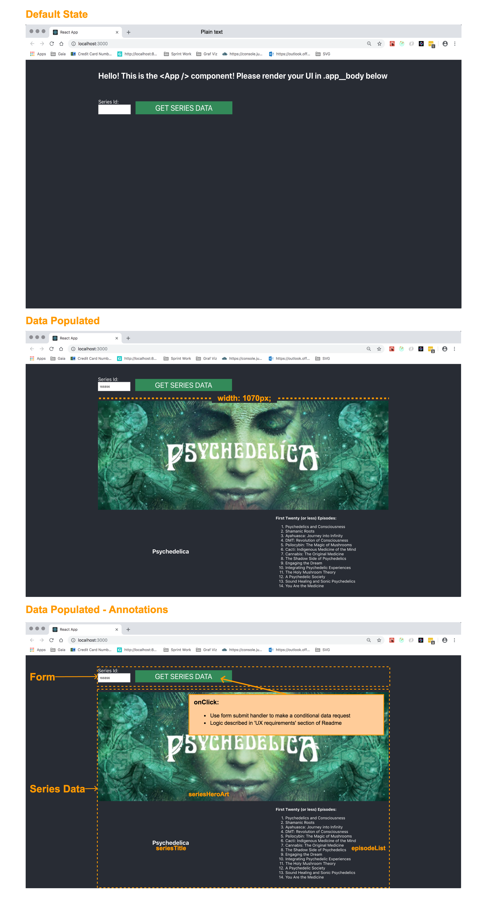

This project was bootstrapped with [Create React App](https://github.com/facebook/create-react-app).

## Fullstack Challenge

### Summary

* In this challenge you are tasked with allowing a user to visualize data for a Gaia series
* There are 2 areas of focus:
  1. The Server: Implement a route handler to request and transform data from multiple public Gaia content endpoints
  1. The Client. Implement a form in React, which takes `seriesId` as an input and fetches data for that series
* The final data will represent a series and up to 20 of its episodes
* All challenge requirements can be found in the [Acceptance Criteria Section](#acceptance-criteria)

### Contents
<!--ts-->
* [Prerequisites](#prerequisites)
* [Running the Project](#running-the-project)
* [Orienting Yourself](#orienting-yourself)
* [Additional Notes](#additional-notes)
* [Acceptance Criteria](#acceptance-criteria)
* [Mocks](#mocks)
* [What we are testing for](#what-we-are-testing-for)
<!--te-->

### Prerequisites
1. npm >= v5.2
1. Nodejs >= v8.x
1. Two open terminals at the root of the application

### Running the Project
1. From a terminal, run `$ npm install` to install dependencies.
1. Run `$ npm start` to start the React application.
1. In a second, separate terminal run `$ npm run server` to start the Express server.
1. The application will be running on `http://localhost:3000`.

### Orienting Yourself
* There are two files that will serve as the starting point, `/src/App.js` and `/src/server/index.js`.
* Find the `TODO` comments in these files; we left you a few hints to get things started.

### Additional Notes
1. Use Redux for state management.
1. Install and use any other packages you like.
1. Organize the codebase in any way you like, adding any additional folders and files you may need.
1. Feel free to be creative, adding any additional features or giving the UI a nice polish.
1. Please spend no more than 4 hours on this exercise.

### Acceptance Criteria
**Please meet as many of the following criteria as you can in the allotted time**

1. Implement a Redux store that maintains application state and separates business logic from presentation.
1. Implement a React form that accepts a numeric value, which represents a Gaia Original Series ID. Example values you can use are `122881`, `179166`, and `166896`.
1. Using the value input by the end-user, make a RESTful call to an endpoint that responds with the Gaia Original Series metadata. You will implement the handler for this API endpoint. The handler should:
   * Use the `seriesId` included on the HTTP request to proxy another external HTTP request.
   * Process and transform the response data (details below) and serve it back in the response to the original request.
   * Handle response errors, bad inputs, etc.
1. When receiving a successful, well-formed response from the API service the React application should render the following:
   * The hero artwork for the series.
   * An ordered list of episode titles in ascending order.
   * The title of the series.
   
_UX and layout requirements are detailed below._

#### Starting Points:
1. Express Server
    * In `/src/server/index.js`
    * Implement an endpoint handler for `/series-videos` that:
      1. Fetches node data > http GET request to `https://brooklyn.gaia.com/node/[:nodeId]`
        * Data from this endpoint will look like `exampleNodeData`
        * Datapoints to use:
          * Series hero art -- `<response body>.hero_image.hero_1070x400`
          * Series title -- `<response body>.title`
      1. Then fetches Episode data > http GET request to `https://brooklyn.gaia.com/v2/videos/series/[:seriesId]`
        * Successful response from this endpoint will be an array of videos.
          * You will only be using the `title` and `episode` datapoints from each of the videos.
          * This route is paginated but please do **NOT** implement pagination.
          * The endpoint will return up to 20 episodes by default (use these)
      1. Return necessdary data as JSON in whatever shape makes the most sense to you.
      1. Don't forget to validate inputs and handle any errors that may occur.

1. React Application
    * Design mocks are below.
    * No need to make this a responsive layout.
    * The app container should not exceed `1070px`
    * Form label and button text are defined in the mocks.
    * **UX Requirements:**
      * Form Should:
        * make a request for series data using the input value provided by the user.
        * display a processing/loading state while the http request is in transit.
        * display an error state should an http request be unsuccessful.
        * Should not attempt to make a request if:
          * The input is empty.
          * The app is already displaying data for the current `seriesId` form value.
          * The user tries to use any non-numeric value for `seriesId`.
        * If there is already a request in progress and the user tries to re-submit a new id
          * Cancel the request in process and create a new one **OR**
          * Do not allow for new form submission until the last request is complete.
      * [Form States](#form-states):
        * Processing - any time an http request is triggered by the form
          * Use a clear visual indicator that the application is processing a request
          * A simple 'Thinking' string is sufficient
        * Error - If the request returns an error
          * Use a clear visual indicator that the last request failed
          * A generic 'Request Failed' message is sufficient

### Mocks
#### Default View

#### Form States

### What we are testing for:
  * Does the solution satisfy the acceptance criteria?
  * React:
    * Effective and consistent state management
    * Separation of Model [requests, business logic and application state] from View.
    * Requesting data, handling inputs, response, and any errors along the way.
    * Understanding of the React lifecycle.
    * Well-defined component Structure.
    * Concise styling.
    * Semantic Markup.
  * Express Server:
    * Concurrent http requests.
    * Manipulating data.
    * Basic error handling.
  * Confidence in solution accuracy.
